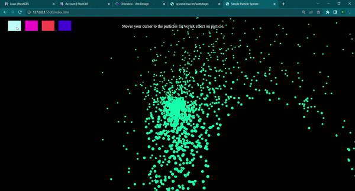

# Particle System in JS

Particle System with wind effect, developed in vanilla JS. System includes pooling of particles from particle pool to reason with memory efficiently. Each Particle handles it's lifecycle itself including gravity, velocity, wind force, etc. We're using 2D Canvas API in JS for rendering. This was developed while learning and trying to implement in to a game.

	

## LIVE DEMO

## Tech Used

- HTML
- Vanilla JS
